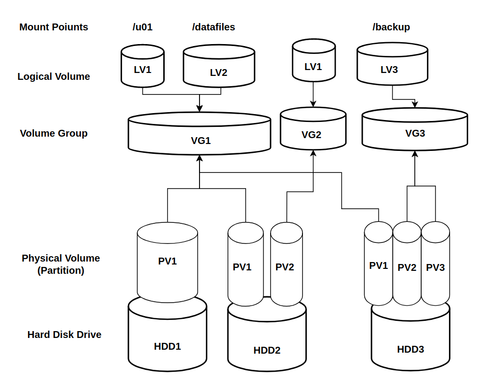

# LVM2 (Logical Volume Manager)


## 1- What is LVM

**Logical Volume Manager** (**LVM**) is a device mapper framework that provides logical volume management for the Linux kernel.  Most modern Linux distributions are LVM-aware to the point of being able to have their root file systems on a logical volume. The Logical Volume Manager (LVM) provides tools to create virtual block devices from physical devices.  Virtual devices may be easier to manage than physical devices, and can have capabilities beyond what the physical devices provide themselves.  A Volume Group (VG) is a collection of one or more physical devices, each called a Physical Volume (PV).  A Logical Volume (LV) is avirtual block device that can be used by the system or applications.  Each block of data in an LV is stored on one or more PV in the VG, according to algorithms implemented by Device Mapper (DM) in the kernel.





## 2- Why We need LVM?


The biggest advantage of LVM is that both logical and physical  volumes can be created, deleted and resized online, without any  restarts.

Logical volumes can also be resized dynamically, so you can start for example with a small partition and configure it to expand as data is  written on it.

Any number of disks and partitions can be unified into a big one, or a single physical disk can be quickly split into many partitions of any  size.

In addition, LVM allows the creation of instant logical volume  snapshots while the operating system is running and supports advanced  encryption features. 

Besides that, LVM gives the system administrator much more flexibility in allocating storage to applications and users.   the main advantages of the LVM are: 

* Flexibility: you can extend,shrink resize volumes as per your business requirements .
* Easy to Migrate: Allow you to migration to different storage with simple command and few steps.
* Scalability: add more physical disks and scall the space if that required after few years is an easy task using lvm.

 

## 3- LVM Operations

Here I will try to cover the most LVM Administration scenarios which can mimic real life situations.  


> Disclaimer: Please don't implement those scenarios direct to the Production system, try to do it first on testing environemt.


### LVM - PV VG LV Creation 

Create Adding PV VG LV

```bash
# List Disks 
lsblk | grep -i 'sd[a-z]'

# list available disk
lvmdiskscan | grep -v loop

# check the pvs
pvs

# Format the Disks 
fdisk /dev/sdb # create sdb1 and sdb2
fdisk /dev/sdc # create sdc1

# create pv 
pvcreate /dev/sdb1 /dev/sdc1

#check vgs 
vgs 

# create vg
vgcreate data_vg /dev/sdb1 /dev/sdc1


# create lv 
lvcreate data_vg -n data_lv -L 2G

# Make FS 
mkfs.ext4 /dev/mapper/data_vg-data_lv

# Create lv remaining space 
lvcreate data_vg -n lv_log -l 100%FREE

# make fs 
mkfs.ext4 /dev/mapper/data_vg-lv_log

# mk dirs 
mkdir /data /log

# mount 
mount /dev/mapper/data_vg-lv_log /log
mount /dev/mapper/data_vg-data_lv /data
```

### 3.2- LVM - VG LV Extend Operation

Extend VG amd LV to have more space 

>The difference is that **lvextend can only increase the size of a volume, whereas lvresize can increase or reduce it**. This makes lvresize more powerful but more dangerous.

```bash

# Check pv
pvs

# check the vg
vgs 

# check the lvs
lvs 


# check if resize_inode options is active 

tune2fs -l /dev/data_vg/data_lv | grep resize_inode

# check available disks 
lvmdiskscan | grep -v loop
lsblk | grep -v loop

# create PV 
pvcreate /dev/sdb2

# Check pv
pvs

# add pv to vg
vgextend data_vg /dev/sdb2

# Check pv
pvs

# check the vg
vgs 


# check the mount
mount | grep data_lv

# fsck
 fsck -N /dev/mapper/data_vg-data_lv

# check current lv size 
lvs 
df -h | grep -v "tmpfs\|loop" | grep data_lv

# extend lv using automatic way 
lvresize --resizefs /dev/mapper/data_vg-data_lv -L +1G

# check the vg
vgs 

# check the lvs
lvs 

# extend lv using manual way 
lvextend /dev/mapper/data_vg-data_lv -L 4G

# check current lv size 
lvs 
df -h | grep -v "tmpfs\|loop" | grep data_lv


# resize to fs
resize2fs /dev/data_vg/data_lv

# check lvs 
lvs 

# vgs lvs 
vgs 
lvs 

# extend and resize with full size of the VG 
lvextend /dev/mapper/data_vg-data_lv -l +100%FREE

# check 
vgs 
lvs 
df -h | grep -v "tmpfs\|loop" | grep data_lv

# resize to fs
resize2fs /dev/data_vg/data_lv

# check 
vgs 
lvs 
df -h | grep -v "tmpfs\|loop" | grep data_lv

```

### 3.3- LVM- LV Shrink Operation

In the last Section we have learned how to add more space to VG and LV, so this video will be about, how we can Shrink the LV, the shrinking process is risky task need preparation before you performing it on production env, and the main goal of lvreduce is to free some space to VG. Please to Pay attention for two things, first one is, the LV used space and available space, you need to shrink the freespace amount, don't try to shrink more than the freespace, the second one you need to check the filesystem whether it ext4, xfs or any other filesystems this is important to see how you can perform the shrink operation.

to perform shrink operation you need to understand one think you have two layers first one is the Logical Volume (LV) belongs to lvm, and the second one is os filesystem (FS), that means you need first to shrink the filesystem then you need to reduce or resize the LV, note that  if you reduce the LV without do it first on filesystem, the logical volume (LV)  (FileSystem) FS will be currepted.

EXT4 filesystem not support online shrink  you need to umount the LV first then you can resize the FS then reduce or shrink the LV

XFS filesystem is not supporting shrink operation till now as per the xfs offical site published on 2019. 


```bash

# Before proceed to shrink task 
# 1- what the FS you have ext4,xfs ..etc.
# 2- check free space for LV.
# 3- the size you can give for LV

# ## Shrink the ext4 file system and the LVM LV

# check the free space 
vgs 

# check 
lvs 


# check free space 
df -h | grep -v 'loop\|tmpfs'

# check mount 
mount | grep -i data 


# umount 
umount /data

#  lvresize provides an automatic resize underlaying 
filesystem
# --size option takes the intended new LV size 
# --resizefs resize the underlaying filesystem
lvresize --resizefs --size 2G /dev/data_vg/data_lv

#mount 
mount /dev/mapper/data_vg-data_lv /data

# check size
df -h | grep -v 'loop\|tmpfs'

# write dump data 
dd if=/dev/zero of=/data/test1 bs=3M count=100

# check space again 
df -h | grep -v 'loop\|tmpfs'

# lvreduce Manual way 

# check mount 
mount | grep -v loop 

# check free space 
# check free space
df -h | grep -v 'loop\|tmpfs'1

# umount 
umount /logs 

# shrink fs 
e2fsck -f /dev/mapper/data_vg-log_lv
resize2fs /dev/mapper/data_vg-log_lv 2G

# reduce lv 
lvreduce -L 2G /dev/mapper/data_vg-log_lv

# check lvs 
lvs data_vg

# check fs 
e2fsck -f /dev/mapper/data_vg-data_lv

# mount 
mount /dev/mapper/data_vg-log_lv /logs

# check size
df -h | grep -v 'loop\|tmpfs'

# write dump data 
dd if=/dev/zero of=/logs/test1 bs=3M count=100

# check space again 
df -h | grep -v 'loop\|tmpfs'

```

### 3.4- LVM- VG Migration

This section will cover the volume group migration. Well, we have two ways for Volume group migration , the first one is using LVM mirroring and the second one is using LVM pvmove command. This video will cover the second way which is pvmove command, also in this video we have two scenarios will be covered, the first one will be re-claim the PV and migrate VG to one partition within the Volume Group (VG) and the second one will be migrate Volume Group (VG) to new hard drive  :

```bash

# there is many reasons sometime force us to migrate the Volume group on of those reasons we need to reclaim some partitions or to replace a faulty disk, or replace an existing smaller size disk with a large one.

# list all available disks 
lsblk | grep -v loop 

# vgs gather some stats 
vgs -o+devices | grep data_vg


# lvs check the lv belong to this VG
lvs -o+devices data_vg 

# check the used space help us to see how log pvmove will take
df -h | grep -v 'loop\|tmpfs'
pvs -o+pv_used
pvs -o+pv_used| grep -i data_vg

# pvmove to the desired partition 
pvmove /dev/sdb1 /dev/sdc1
pvmove /dev/sdb2 /dev/sdc1

# check pvs 
pvs -o+pv_used

# check the lsblk
lsblk | grep -v loop 

###########
# Migrate to new added disk 
###########

# list all available disks 
lsblk | grep -v loop 

# fdisk the new drive 
fdisk /dev/sdd
# n p 1 enter enter t 8e p w

#pvs and vgs 
vgs 
pvs 

# create pv 
pvcreate /dev/sdd1 

# pvs and vgs  
pvs 
vgs 

# add PV to VG
vgextend data_vg /dev/sdd1

# pvs and vgs  
pvs 
vgs 

# check 
pvs -o+pv_used

pvmove /dev/sd[bc][12]

# reduce the vg
vgreduce data_vg /dev/sd[bc][12]

# check 
pvs -o+pv_used


```


### 3.5- LVM- PV VG LV Removal Operations

This secition will cover the removing of PV VG LV, but before we get started, please to be careful, this operation will wipe out all the data from the disks, so please don't perform it on systems that have critical production data or sensitive data, and if its so, please make sure to take a backup of those data before perform the LVM removal operation. With all that being said, lets jump in to the demonstration.

```bash
#Check the mount points 
df -h | grep -v 'loop\|tmpfs' | grep data

# check the lv belongs to vg 
 lvs data_vg
 lsblk | grep -v loop 

# check if the disk mounted 
mount | grep data_vg

# umount the disk 
umount /data /logs
mount | grep data_vg

# remove lv
lvs data_vg
lvremove -f  /dev/data_vg/data_lv /dev/data_vg/log_lv
lvs data_vg

# check the lvs belong to the vg
lsblk | grep -v loop

# check the vg 
vgs data_vg
pvs 

# remove vg
vgremove data_vg

# check vgs 
vgs 

# check the pvs
pvs

# remove the pvs 
pvremove /dev/sdb1 /dev/sdb2 /dev/sdc1 /dev/sdd1
pvremove /dev/sd[bcd][12]

# check again pvs 
pvs
lsblk | grep -v loop

# delete partitions 

fdisk /dev/sdb
fdisk /dev/sdc
fdisk /dev/sdd

# check the disks 
lsblk | grep -v loop

```


