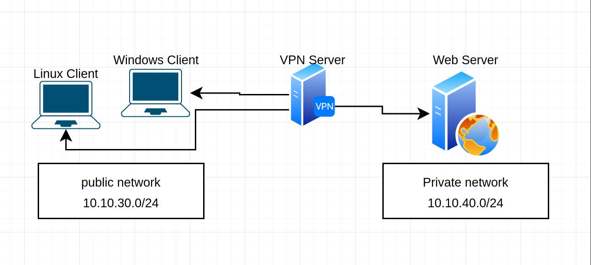
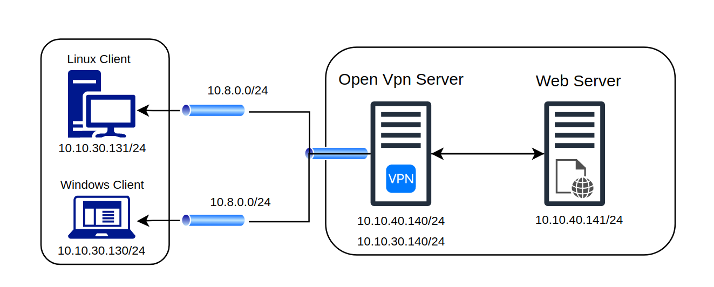

# OpenVPN tunnel to Private Network


This document will show you how to setup an open vpn to reach the private network from outside. The demo her mimic real life scenario. Check below the lab diagram:



we need to configure open vpn to reach the internal or private web page. to do that we need to understand the network we have, below table will show the network for each server and the assigned IP in the lab:

| Service        | IP                          | Subnet                        | OS                   |
| -------------- | --------------------------- | ----------------------------- | -------------------- |
| web server     | 10.10.40.141                | 10.10.40.0/24                 | Ubuntu 20.04 Server  |
| openvpn server | 10.10.30.140 - 10.10.40.141 | 10.10.30.0/24 - 10.10.40.0/24 | Ubuntu 20.04 Server  |
| window client  | 10.10.30.130                | 10.10.30.0/24                 | Windows 10           |
| Linux Client   | 10.10.30.131                | 10.10.30.0/24                 | Ubuntu 20.04 Desktop |

The problem here we cant reach the web server (10.10.30.141/24) from Windows and Linux clients (10.10.30.130/24 - 10.10.30.131/24), to solve this problem we can tunnel the connection to route to the private or internal network, to reach the web server.

Follow below demo to be able to configure the VPN to reach the internal network.  

## Setup Environment

Below the detailed lab figure will show you an overview how the lab will be.




### 1- OverView 


**OVPN Server Steps**

* Check the connectivity between the servers and clients 
* Install Openvpn server 
* Download easy-rsa software from github
* Initiate the PKI and create server and client certs & Keys
* Configure Openvpn server

**Linux Client Steps**

* Copy the ca,crt,key tc from server to linux client 
* Configure the Linux Client
* Test Connectivity 

**Windows Client Steps**

* Copy the ca,crt,key tc from server to Windows client 
* Configure Windows Client
* Test Connectivity 

**Final Step**

* Test the connectivity
* Reach the server web page .

### 2- Cheatsheet 

#### 2.1- OpenVPN Server.

```bash
# Web Server IP
ip a | grep "inet 10"

# OVPN server IPs
ip a | grep "inet 10"

# linux Client IP

ip a | grep "inet 10"

# Windows Client IP
ipconfig |findstr -i ipv4

# web server 
ping 10.10.40.141

#curl web page 
curl http://10.10.40.141

# windows client 
ping 10.10.30.130

#Linux Client
ping 10.10.30.131

# install openvpn 
sudo apt install openssl openvpn ca-certificates easy-rsa

# create easy-rsa 
mkdir /etc/openvpn/server/easy-rsa/ 
easy_rsa_url='https://github.com/OpenVPN/easy-rsa/releases/download/v3.0.8/EasyRSA-3.0.8.tgz'
wget -qO- "$easy_rsa_url" 2>/dev/null | tar xz -C /etc/openvpn/server/easy-rsa/ --strip-components 1

#change the owner of the files 
chown -R root:root /etc/openvpn/server/easy-rsa/

# Init the PKI 
cd /etc/openvpn/server/easy-rsa/
./easyrsa init-pki

# Create DIRs to keep the files 
mkdir server lnx_client win_client
mkdir lnx_client
mkdir win_client

# build CA
./easyrsa --batch build-ca nopass

# Build Server cert & key
EASYRSA_CERT_EXPIRE=3650 ./easyrsa build-server-full server nopass


# Create crl 
EASYRSA_CRL_DAYS=3650 ./easyrsa gen-crl

# Create DH paramter 
openssl dhparam -out pki/dh.pem 2048

# Create TLS Crypt key 
openvpn --genkey --secret pki/tc.key

# Copy all the needed files to folder server 
cp pki/ca.crt pki/private/ca.key pki/private/server.key pki/issued/server.crt  pki/dh.pem pki/crl.pem pki/tc.key server/

# build Linux client Cert & Key 
EASYRSA_CERT_EXPIRE=3650 ./easyrsa build-client-full lnx_client01

# Copy Linux client files 
cp pki/ca.crt pki/private/lnx_client01.key pki/tc.key pki/issued/lnx_client01.crt lnx_client/

# build Windows client Cert & Key 
EASYRSA_CERT_EXPIRE=3650 ./easyrsa build-client-full win_client01

# Copy Windows  client files 
cp pki/ca.crt pki/tc.key pki/issued/win_client01.crt pki/private/win_client01.key win_client/


# tar the client folders 
tar -cvf lnx_client.tar lnx_client/
zip win_client.zip win_client/*

# copy server files to server folder 
cp server/* ../

# grant the server ability to forward the IP (IP Forwarding)
echo 'net.ipv4.ip_forward=1' > /etc/sysctl.d/99-openvpn-forward.conf
echo 1 > /proc/sys/net/ipv4/ip_forward
sysctl --system

# create Config file 
vim server.conf
cat server.conf

# Generate server.conf
local 10.10.30.140
port 443
proto tcp
dev tun
ca ca.crt
cert server.crt
key server.key
dh dh.pem
tls-crypt tc.key
crl-verify crl.pem
auth SHA512
topology subnet
server 10.8.0.0 255.255.255.0
ifconfig-pool-persist ipp.txt
route 10.10.40.0 255.255.255.0
push "route 10.10.40.0 255.255.255.0"
push "redirect-gateway def1"
keepalive 10 120
cipher AES-256-GCM
user nobody
group nogroup
persist-key
persist-tun
verb 3
status /var/log/openvpn/openvpn-status.log
log-append  /var/log/openvpn/openvpn.log

# Enable Openvpn Server Service 
systemctl enable openvpn-server@server.service
systemctl start openvpn-server@server.serivce

# not pinging add nat table with below config 
iptables -t nat -A POSTROUTING -s 10.8.0.0/24 -d 10.10.40.0/24 -j MASQUERADE
```


#### 2.2- Linux Client.

```bash
# Download openvpn linux client files from server 
scp ovpnadm@10.10.30.140:/etc/openvpn/server/easy-rsa/lnx_client.tar /tmp

# Untar on linux client
tar --strip-components 1 -xvf /tmp/lnx_client.tar -C /etc/openvpn/client/
ls -l /etc/openvpn/client/

# Client.conf
vim /etc/openvpn/client/client.conf
cat client.conf
client
dev tun
proto tcp
remote 10.10.30.140 443
ca /etc/openvpn/client/ca.crt
cert /etc/openvpn/client/lnx_client01.crt
key /etc/openvpn/client/lnx_client01.key
tls-crypt /etc/openvpn/client/tc.key
askpass
resolv-retry infinite
nobind
persist-key
persist-tun
remote-cert-tls server
auth SHA512
cipher AES-256-GCM
ignore-unknown-option block-outside-dns
block-outside-dns
verb 3

ls /etc/openvpn/client/

# disable current openvpn service 
systemctl disable openvpn.service
systemctl enable openvpn@client.service

# edit service file 
vim /lib/systemd/system/openvpn@client.service

# change this part 
--config /etc/openvpn/%i.conf

# to be like below 
--config /etc/openvpn/client/%i.conf

# start Service 
systemctl start openvpn@client.service

# Create new service related to our config file 
systemctl enable openvpn@client.service

# reload 
systemctl daemon-reload

```


#### 2.3- Windows Client.

```bash

scp ovpnadm@10.10.30.140:/etc/openvpn/server/easy-rsa/win_client.zip .\Desktop\


# client.ovpn
client
dev tun
proto tcp
remote 10.10.30.140 443

ca ca.crt
cert win_client01.crt
key win_client01.key
tls-crypt tc.key

resolv-retry infinite
nobind
persist-key
persist-tun
remote-cert-tls server
#auth SHA512
cipher AES-256-GCM
ignore-unknown-option block-outside-dns
block-outside-dns
verb 3

```


### 3- Detailed Steps 

#### 3.1- OVPN Server Steps

* OpenVPN connectivity for Clients and web server. 

  ```bash
  
  # Web Server IP
  
  webadm@websrv01:~$ ip a | grep "inet 10"
      inet 10.10.40.141/24 brd 10.10.40.255 scope global ens33
  webadm@websrv01:~$
  
  
  # OVPN server IPs
  
  root@ovpnsrv01:~# ip a | grep "inet 10"
      inet 10.10.40.140/24 scope global ens34
      inet 10.10.30.140/24 scope global ens37
  
  # linux Client IP
  
  root@client02:~# ip a | grep "inet 10"
      inet 10.10.30.131/24 brd 10.10.30.255 scope global noprefixroute ens33
  root@client02:~# 
  
  # Windows Client IP
  
  PS C:\> ipconfig |findstr -i ipv4
     IPv4 Address. . . . . . . . . . . : 10.10.30.130
  PS C:\>
  
  
  # web server 
  root@ovpnsrv01:~# ping 10.10.40.141
  PING 10.10.40.141 (10.10.40.141) 56(84) bytes of data.
  64 bytes from 10.10.40.141: icmp_seq=1 ttl=64 time=0.955 ms
  64 bytes from 10.10.40.141: icmp_seq=2 ttl=64 time=0.984 ms
  ^C
  --- 10.10.40.141 ping statistics ---
  2 packets transmitted, 2 received, 0% packet loss, time 1002ms
  rtt min/avg/max/mdev = 0.955/0.969/0.984/0.014 ms
  root@ovpnsrv01:~#
  
  # windows client 
  root@ovpnsrv01:~# ping 10.10.30.130
  PING 10.10.30.130 (10.10.30.130) 56(84) bytes of data.
  64 bytes from 10.10.30.130: icmp_seq=1 ttl=128 time=1.02 ms
  64 bytes from 10.10.30.130: icmp_seq=2 ttl=128 time=1.07 ms
  ^C
  --- 10.10.30.130 ping statistics ---
  2 packets transmitted, 2 received, 0% packet loss, time 1002ms
  rtt min/avg/max/mdev = 1.015/1.044/1.074/0.029 ms
  root@ovpnsrv01:~#
  
  #Linux Client
  root@ovpnsrv01:~# ping 10.10.30.131
  PING 10.10.30.131 (10.10.30.131) 56(84) bytes of data.
  64 bytes from 10.10.30.131: icmp_seq=1 ttl=64 time=0.883 ms
  64 bytes from 10.10.30.131: icmp_seq=2 ttl=64 time=0.789 ms
  64 bytes from 10.10.30.131: icmp_seq=3 ttl=64 time=0.789 ms
  ^C
  --- 10.10.30.131 ping statistics ---
  3 packets transmitted, 3 received, 0% packet loss, time 2003ms
  rtt min/avg/max/mdev = 0.789/0.820/0.883/0.044 ms
  root@ovpnsrv01:~#
  ```
  
  

* Install Openvpn server 

  ```bash
  root@ovpnsrv01:~# apt install openssl openvpn ca-certificates easy-rsa
  ```

  

* Download easy-rsa software from github

  ```bash
  # create easy-rsa 
  root@ovpnsrv01:~# mkdir /etc/openvpn/server/easy-rsa/ 
  root@ovpnsrv01:~# easy_rsa_url='https://github.com/OpenVPN/easy-rsa/releases/download/v3.0.8/EasyRSA-3.0.8.tgz'
  
  root@ovpnsrv01:~# wget -qO- "$easy_rsa_url" 2>/dev/null | tar xz -C /etc/openvpn/server/easy-rsa/ --strip-components 1
  root@ovpnsrv01:~#
  
  # change the owner of the files 
  root@ovpnsrv01:~# chown -R root:root /etc/openvpn/server/easy-rsa/
  ```

  

* Initiate the PKI and create server and client certs & Keys

  ```bash
  root@ovpnsrv01:/etc/openvpn/server/easy-rsa# ./easyrsa init-pki
  
  init-pki complete; you may now create a CA or requests.
  Your newly created PKI dir is: /etc/openvpn/server/easy-rsa/pki
  
  # Create DIRs to keep the files 
  
  root@ovpnsrv01:/etc/openvpn/server/easy-rsa# mkdir server
  root@ovpnsrv01:/etc/openvpn/server/easy-rsa# mkdir lnx_client
  root@ovpnsrv01:/etc/openvpn/server/easy-rsa# mkdir win_client
  
  # build CA
  root@ovpnsrv01:/etc/openvpn/server/easy-rsa# ./easyrsa --batch build-ca nopass
  Using SSL: openssl OpenSSL 1.1.1f  31 Mar 2020
  Generating RSA private key, 2048 bit long modulus (2 primes)
  ...................................................................................+++++
  ................................+++++
  e is 65537 (0x010001)
  
  
  # Build Server cert & key
  
  root@ovpnsrv01:/etc/openvpn/server/easy-rsa# EASYRSA_CERT_EXPIRE=3650 ./easyrsa build-server-full server nopass
  Using SSL: openssl OpenSSL 1.1.1f  31 Mar 2020
  Generating a RSA private key
  .........+++++
  .....+++++
  writing new private key to '/etc/openvpn/server/easy-rsa/pki/easy-rsa-13602.b3jix6/tmp.kvTltz'
  -----
  Using configuration from /etc/openvpn/server/easy-rsa/pki/easy-rsa-13602.b3jix6/tmp.Ks1rq1
  Check that the request matches the signature
  Signature ok
  The Subject's Distinguished Name is as follows
  commonName            :ASN.1 12:'server'
  Certificate is to be certified until Feb 19 19:21:57 2032 GMT (3650 days)
  
  Write out database with 1 new entries
  Data Base Updated
  
  root@ovpnsrv01:/etc/openvpn/server/easy-rsa#
  
  # Create crl 
  
  root@ovpnsrv01:/etc/openvpn/server/easy-rsa# EASYRSA_CRL_DAYS=3650 ./easyrsa gen-crl
  Using SSL: openssl OpenSSL 1.1.1f  31 Mar 2020
  Using configuration from /etc/openvpn/server/easy-rsa/pki/easy-rsa-13837.ixAyjL/tmp.p9fQJy
  
  An updated CRL has been created.
  CRL file: /etc/openvpn/server/easy-rsa/pki/crl.pem
  
  # Create DH paramter 
  
  root@ovpnsrv01:/etc/openvpn/server/easy-rsa# openssl dhparam -out pki/dh.pem 2048
  Generating DH parameters, 2048 bit long safe prime, generator 2
  This is going to take a long time
  ...................................+..........................+.............+...................................+.................................+............+.......................
  --snipped--
  ......+..........................................................................................................................................+....................................++*++*++*++*
  root@ovpnsrv01:/etc/openvpn/server/easy-rsa#
  
  # Create TLS Crypt key 
  
  root@ovpnsrv01:/etc/openvpn/server/easy-rsa# openvpn --genkey --secret pki/tc.key
  
  
  
  # Copy all the needed files to folder server 
  
  root@ovpnsrv01:/etc/openvpn/server/easy-rsa# cp pki/ca.crt pki/private/ca.key pki/private/server.key pki/issued/server.crt  pki/dh.pem pki/crl.pem pki/tc.key server/
  root@ovpnsrv01:/etc/openvpn/server/easy-rsa#
  
  # build Linux client Cert & Key 
  
  root@ovpnsrv01:/etc/openvpn/server/easy-rsa# EASYRSA_CERT_EXPIRE=3650 ./easyrsa build-client-full lnx_client01
  Using SSL: openssl OpenSSL 1.1.1f  31 Mar 2020
  Generating a RSA private key
  .........................................+++++
  .................................................................................................................................................................+++++
  writing new private key to '/etc/openvpn/server/easy-rsa/pki/easy-rsa-14313.Z9YWv0/tmp.zckDvl'
  Enter PEM pass phrase:
  Verifying - Enter PEM pass phrase:
  -----
  Using configuration from /etc/openvpn/server/easy-rsa/pki/easy-rsa-14313.Z9YWv0/tmp.kodQ3a
  Check that the request matches the signature
  Signature ok
  The Subject's Distinguished Name is as follows
  commonName            :ASN.1 12:'lnx_client01'
  Certificate is to be certified until Feb 19 19:43:25 2032 GMT (3650 days)
  
  Write out database with 1 new entries
  Data Base Updated
  
  root@ovpnsrv01:/etc/openvpn/server/easy-rsa# 
  
  # Copy Linux client files 
  root@ovpnsrv01:/etc/openvpn/server/easy-rsa# cp pki/ca.crt pki/private/lnx_client01.key pki/tc.key pki/issued/lnx_client01.crt lnx_client/
  
  
  # build Windows client Cert & Key 
  
  root@ovpnsrv01:/etc/openvpn/server/easy-rsa# EASYRSA_CERT_EXPIRE=3650 ./easyrsa build-client-full win_client01
  Using SSL: openssl OpenSSL 1.1.1f  31 Mar 2020
  Generating a RSA private key
  ......................................+++++
  ..+++++
  writing new private key to '/etc/openvpn/server/easy-rsa/pki/easy-rsa-14383.LqTMBz/tmp.ZZEAl1'
  Enter PEM pass phrase:
  Verifying - Enter PEM pass phrase:
  -----
  Using configuration from /etc/openvpn/server/easy-rsa/pki/easy-rsa-14383.LqTMBz/tmp.MRf5GZ
  Check that the request matches the signature
  Signature ok
  The Subject's Distinguished Name is as follows
  commonName            :ASN.1 12:'win_client01'
  Certificate is to be certified until Feb 19 19:43:59 2032 GMT (3650 days)
  
  Write out database with 1 new entries
  Data Base Updated
  
  root@ovpnsrv01:/etc/openvpn/server/easy-rsa#
  
  
  # Copy Windows  client files 
  
  root@ovpnsrv01:/etc/openvpn/server/easy-rsa# cp pki/ca.crt pki/tc.key pki/issued/win_client01.crt pki/private/win_client01.key win_client/
  
  
  # tar the client folders 
  
  root@ovpnsrv01:/etc/openvpn/server/easy-rsa# tar -cvf lnx_client.tar lnx_client/
  lnx_client/
  lnx_client/tc.key
  lnx_client/lnx_client01.key
  lnx_client/lnx_client01.crt
  lnx_client/ca.crt
  
  root@ovpnsrv01:/etc/openvpn/server/easy-rsa# zip win_client.zip win_client/*
    adding: win_client/ca.crt (deflated 25%)
    adding: win_client/tc.key (deflated 40%)
    adding: win_client/win_client01.crt (deflated 45%)
    adding: win_client/win_client01.key (deflated 24%)
  
  
  
  root@ovpnsrv01:/etc/openvpn/server/easy-rsa# scp win_client.zip openvpn_client@10.10.30.130:c:/users/openvpn_client/desktop
  openvpn_client@10.10.30.130's password:
  win_client.zip                         100% 6016     2.2MB/s   00:00
  root@ovpnsrv01:/etc/openvpn/server/easy-rsa#
  ```

  

* Configure Openvpn server

  ```bash
  # copy the server files to server folder 
  root@ovpnsrv01:/etc/openvpn/server/easy-rsa# cp server/* ../
  
  # grant the server ability to forward the IP (IP Forwarding)
  
  
  root@ovpnsrv01:/etc/openvpn/server# echo 'net.ipv4.ip_forward=1' > /etc/sysctl.d/99-openvpn-forward.conf
  root@ovpnsrv01:/etc/openvpn/server# echo 1 > /proc/sys/net/ipv4/ip_forward
  root@ovpnsrv01:/etc/openvpn/server# sysctl --system
  
  # create Config file 
  
  root@ovpnsrv01:/etc/openvpn/server# vim server.conf
  root@ovpnsrv01:/etc/openvpn/server# cat server.conf
  # Generate server.conf
  local 10.10.30.140
  port 443
  proto tcp
  dev tun
  ca ca.crt
  cert server.crt
  key server.key
  dh dh.pem
  tls-crypt tc.key
  crl-verify crl.pem
  auth SHA512
  topology subnet
  server 10.8.0.0 255.255.255.0
  ifconfig-pool-persist ipp.txt
  route 10.10.40.0 255.255.255.0
  push "route 10.10.40.0 255.255.255.0"
  push "redirect-gateway def1"
  keepalive 10 120
  cipher AES-256-GCM
  user nobody
  group nogroup
  persist-key
  persist-tun
  verb 3
  status /var/log/openvpn/openvpn-status.log
  log-append  /var/log/openvpn/openvpn.log
  
  # Enable Openvpn Server Service 
  
  root@ovpnsrv01:/etc/openvpn/server# systemctl enable openvpn-server@server.service
  Created symlink /etc/systemd/system/multi-user.target.wants/openvpn-server@server.service → /lib/systemd/system/openvpn-server@server.service.
  root@ovpnsrv01:/etc/openvpn/server# systemctl start openvpn-server@server.serivce
  
  
  # not pinging add nat table with below config 
  iptables -t nat -A POSTROUTING -s 10.8.0.0/24 -d 10.10.40.0/24 -j MASQUERADE
  ```

#### 3.2- Linux Client Steps

* Copy the ca,crt,key tc from server to linux client.

  ```bash
  # move files to Linux Client  
  # Download openvpn linux client files from server 
  root@client02:~# scp ovpnadm@10.10.30.140:/etc/openvpn/server/easy-rsa/lnx_client.tar /tmp
  ovpnadm@10.10.30.140's password:
  lnx_client.tar               100%   20KB   4.6MB/s   00:00
  root@client02:~#
  
  
  # Untar on linux client
  
  root@client02:~# tar --strip-components 1 -xvf /tmp/lnx_client.tar -C /etc/openvpn/client/
  lnx_client/tc.key
  lnx_client/lnx_client01.key
  lnx_client/lnx_client01.crt
  lnx_client/ca.crt
  root@client02:~# ls -l /etc/openvpn/client/
  total 20
  -rw------- 1 root root 1192 Feb 21 23:47 ca.crt
  -rw------- 1 root root 4492 Feb 21 23:47 lnx_client01.crt
  -rw------- 1 root root 1854 Feb 21 23:47 lnx_client01.key
  -rw------- 1 root root  636 Feb 21 23:47 tc.key
  root@client02:~#
  
  
  ```

  

* Configure the Linux Client.

  ```bash
  # Client.conf
  
  root@client02:/etc/openvpn/client# cat client.conf
  client
  dev tun
  proto tcp
  remote 10.10.30.140 443
  ca /etc/openvpn/client/ca.crt
  cert /etc/openvpn/client/lnx_client01.crt
  key /etc/openvpn/client/lnx_client01.key
  tls-crypt /etc/openvpn/client/tc.key
  askpass
  resolv-retry infinite
  nobind
  persist-key
  persist-tun
  remote-cert-tls server
  auth SHA512
  cipher AES-256-GCM
  ignore-unknown-option block-outside-dns
  block-outside-dns
  verb 3
  
  
  # disable current openvpn service 
  
  root@client02:/etc/openvpn/client# systemctl disable openvpn.service
  Synchronizing state of openvpn.service with SysV service script with /lib/systemd/systemd-sysv-install.
  Executing: /lib/systemd/systemd-sysv-install disable openvpn
  Removed /etc/systemd/system/multi-user.target.wants/openvpn.service.
  root@client02:/etc/openvpn/client# systemctl enable openvpn@client.service
  Created symlink /etc/systemd/system/multi-user.target.wants/openvpn@client.service → /lib/systemd/system/openvpn@.service.
  
  # edit service file 
  vim /lib/systemd/system/openvpn@.service
  
  # change this part 
  --config /etc/openvpn/%i.conf
  
  # to be like below 
  --config /etc/openvpn/client/%i.conf
  
  # reload 
  systemctl daemon-reload
  
  
  # Start openvpn client service 
  
  
  root@client02:/etc/openvpn/client# systemctl start openvpn@client.service
  
  
  root@client02:~# systemctl status openvpn@client.service
  ● openvpn@client.service - OpenVPN connection to client
       Loaded: loaded (/lib/systemd/system/openvpn@.service; enabled; vendor preset: enabled)
       Active: active (running) since Tue 2022-03-01 20:25:51 +04; 5min ago
         Docs: man:openvpn(8)
               https://community.openvpn.net/openvpn/wiki/Openvpn24ManPage
               https://community.openvpn.net/openvpn/wiki/HOWTO
     Main PID: 5963 (openvpn)
       Status: "Initialization Sequence Completed"
        Tasks: 1 (limit: 4588)
       Memory: 996.0K
       CGroup: /system.slice/system-openvpn.slice/openvpn@client.service
  
  ```

* Test Connectivity 

  ```bash
  # Check the openvpn status 
  systemctl status openvpn@client.service
  
  # ping the private domain [openvpn server]
  ping 10.10.40.140
  
  # ping the private subnet [web server]
  ping 10.10.40.141
  
  # ping the private subnet [web server]
  ping 10.10.40.141
  ```

#### 3.3- Windows Client Steps

* Copy the ca,crt,key tc from server to Windows client

  ```bash
  PS C:\Users\openvpn_client> scp ovpnadm@10.10.30.140:/etc/openvpn/server/easy-rsa/win_client.zip .\Desktop\
  ovpnadm@10.10.30.140's password:
  win_client.zip                                                                                            100% 5876     5.7KB/s   00:00
  PS C:\Users\openvpn_client>
  ```

  

* Configure Windows Client

  ```bash
  client
  dev tun
  proto tcp
  remote 10.10.30.140 443
  
  ca ca.crt
  cert win_client.crt
  key win_client.key
  tls-crypt tc.key
  
  resolv-retry infinite
  nobind
  persist-key
  persist-tun
  remote-cert-tls server
  #auth SHA512
  cipher AES-256-GCM
  ignore-unknown-option block-outside-dns
  block-outside-dns
  verb 3
  
  ```

  

* Test Connectivity

  ```bash
  # ping openvpn server 
  10.10.40.140
  
  # ping web server 
  10.10.40.141
  
  # reach the web server web page 
  
  ```

  


