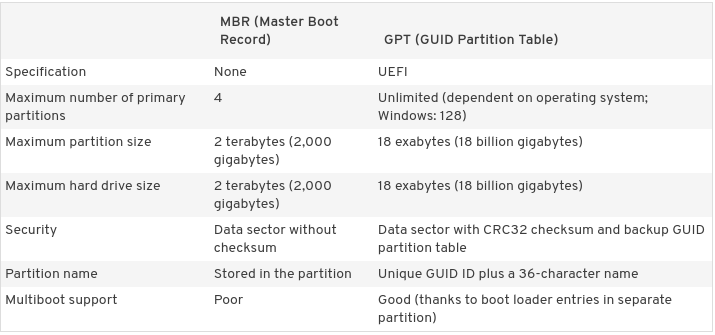

# POP OS Manual Disk partitioning 


## Technologies 

* Vmware Workstation
* UEFI (Unified Extensible Firmware Interface)
* GPT GUID Partition Table (GPT) disks
* LVM2
* FAT32
* EXT4
* POP os 20.10


## Create POP OS VM

setup the vm with UEFI capability 


## Boot To VM


### Checking EFI


Check if boot as EFI or BIOS to create a pratition table acorrdingly 

```bash
$ mount | grep efi 
# output 
efivarfs on /sys/firmware/efi/efivars ---snip---
```


### Partition the Disk

GPT: GUID Partition Table (GPT) disks use Unified Extensible Firmware Interface ([UEFI](https://www.howtogeek.com/56958/htg-explains-how-uefi-will-replace-the-bios/)),One advantage of GPT disks is that you can have more than four partitions on each disk




Partition the  Disk using `parted` program:

```bash
parted /dev/sda

mklabel gpt

mkpart EFI fat32 1 2049 
mkpart Recovery fat32 2049 6145
mkpart SystemData ext4 6145
print

set 1 bios_grub on
set 1 esp on 

```

For `parted` command flags like esp, bios_grub you can find more with this [link](https://www.gnu.org/software/parted/manual/html_node/set.html)

Create a LVM2 layout 

```bash
pvcreate /dev/sda3
vgcreate vg_systemdata /dev/sda3
lvcreate vg_systemdata -n lv_swap -L 4G
lvcreate vg_systemdata -n lv_root -l 100%FREE
```

