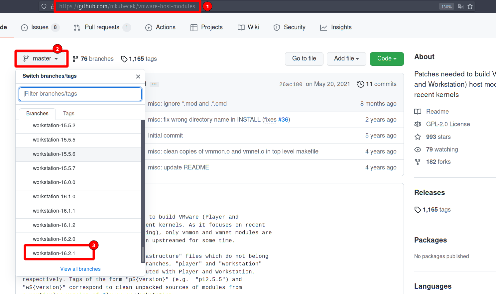

# VMware VMMON VMNET


## Introduction

If you upgrade the your Linux kernel, you VMware will not be able to compile the VMMON and VMENT kernel modules. 

so you need to visit github repository  to download the source code of vmware vmnet and vmmon modules and compile them by yourself.


## How to 


Visit this github [link](https://github.com/mkubecek/vmware-host-modules) to get the source code, note that you need to select branch fit for the vmware version that you have installed on your system. below screenshot show that.





if you see that branch is available select it and then try to download it using below command.

```bash
git clone -b workstation-16.2.1 https://github.com/mkubecek/vmware-host-modules.git
```

then follow below instructions to compile the vmware modules to 

```bash

# In this case, last two commands require root privileges.

cd vmware-host-modules
tar -cf vmmon.tar vmmon-only
tar -cf vmnet.tar vmnet-only

# need root privilege

cp -v vmmon.tar vmnet.tar /usr/lib/vmware/modules/source/
vmware-modconfig --console --install-all
```

Now run your VMware guest, and enjoy.


